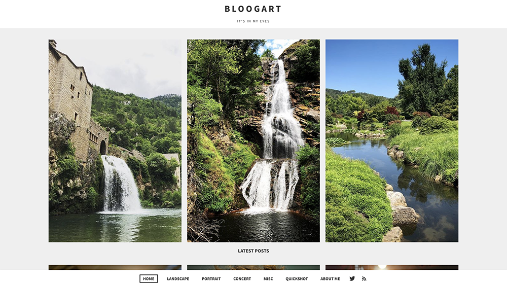

# Hati

A Ghost theme for photography

&nbsp;



&nbsp;

# First time using a Ghost theme?

Ghost uses a simple templating language called [Handlebars](http://handlebarsjs.com/) for its themes.

**The main files are:**

- `default.hbs` - The parent template file, which includes your global header/footer
- `index.hbs` - The main template to generate a list of posts, usually the home page
- `post.hbs` - The template used to render individual posts
- `page.hbs` - Used for individual pages
- `tag.hbs` - Used for tag archives, eg. "all posts tagged with `news`"

# Development

Hati styles are compiled using Gulp/PostCSS to polyfill future CSS spec. You'll need [Node](https://nodejs.org/), [Yarn](https://yarnpkg.com/) and [Gulp](https://gulpjs.com) installed globally. After that, from the theme's root directory:

```bash
# install dependencies
yarn install

# run development server
yarn dev
```

Now you can edit `/assets/css/` files, which will be compiled to `/assets/built/` automatically.

The `zip` Gulp task packages the theme files into `dist/<theme-name>.zip`, which you can then upload to your site.

```bash
# create .zip file
yarn zip
```

# PostCSS Features Used

- Autoprefixer - Don't worry about writing browser prefixes of any kind, it's all done automatically with support for the latest 2 major versions of every browser.
- Variables - Simple pure CSS variables
- [Color Function](https://github.com/postcss/postcss-color-function)


# SVG Icons

Hati uses inline SVG icons, included via Handlebars partials. You can find all icons inside `/partials/icons`. To use an icon just include the name of the relevant file, eg. To include the SVG icon in `/partials/icons/rss.hbs` - use `{{> "icons/rss"}}`.

You can add your own SVG icons in the same manner.

# Copyright & License

This theme is [Unlicensed](LICENSE), feel free to do whatever you want with it.


